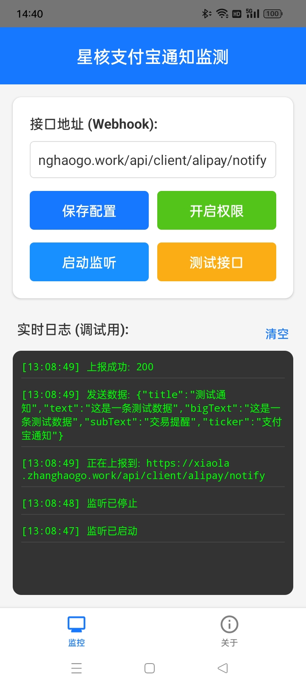

# 星核支付宝通知监测 (AlipayListener)

[](https://reactnative.dev/)
[](https://www.android.com/)
[](LICENSE)

一个基于 Android `NotificationListenerService` 的支付宝收款通知监听工具。它可以实时监控手机通知栏，自动提取收款金额，并通过 Webhook 将数据上报到你的服务器。

> **⚠️ 郑重声明**：
> 本项目仅供学习研究和个人使用。本 App 完全免费，开源透明，**绝不会**窃取您的任何隐私数据。所有数据仅发送至您配置的 Webhook 地址。

## ✨ 功能特性

*   **⚡ 实时监听**：毫秒级响应支付宝转账/收款通知。
*   **💰 智能提取**：内置正则引擎，自动从复杂的通知文本中提取精确金额（支持转账、扫码收款）。
*   **🛡️ 智能过滤**：
    *   自动过滤 "支付宝通知" 等无意义的摘要信息。
    *   自动去重，防止同一笔订单重复上报。
    *   过滤非资金变动类的无关通知。
*   **📡 Webhook 上报**：支持自定义 HTTP POST 接口，数据格式标准。
*   **📝 实时日志**：App 内置实时日志控制台，方便调试和监控。
*   **🎨 简洁界面**：使用 React Navigation 构建的现代化 UI，操作简单。

## 📱 使用截图

<div align="center">
  
</div>

## 🚀 快速开始

### 1. 安装 APK
你可以直接下载 Release 页面中的 `app-release.apk` 安装到 Android 手机。

### 2. 权限设置 (关键)
为了让 App 正常工作，必须授予以下权限：
1.  **通知使用权**：打开 App -> 点击 "开启权限" -> 在系统设置中找到 "星核支付宝通知监测" -> **开启开关**。
2.  **电池优化白名单** (可选但推荐)：允许 App 后台运行，防止被系统杀后台。


### 4. 配置 Webhook
1.  在 App 首页输入你的服务器接口地址 (例如 `http://your-server.com/api/pay/notify`)。
2.  点击 "保存配置"。
3.  点击 "测试接口" 验证连通性。
4.  点击 "启动监听"。

## 📨 上报数据格式

App 会向你的服务器发送 `POST` 请求，`Content-Type: application/json`。

### 请求体示例

```json
{
  "title": "你已成功收款1.20元（老顾客消费）",
  "text": "收到一笔转账 1.20 元",
  "bigText": "...",
  "subText": "交易提醒",
  "ticker": "支付宝通知"
}
```


## 📞 联系作者

如有问题或定制需求，请通过 Telegram 联系：
👉 [https://t.me/zhanghaogo](https://t.me/zhanghaogo)

## 📄 License

MIT
